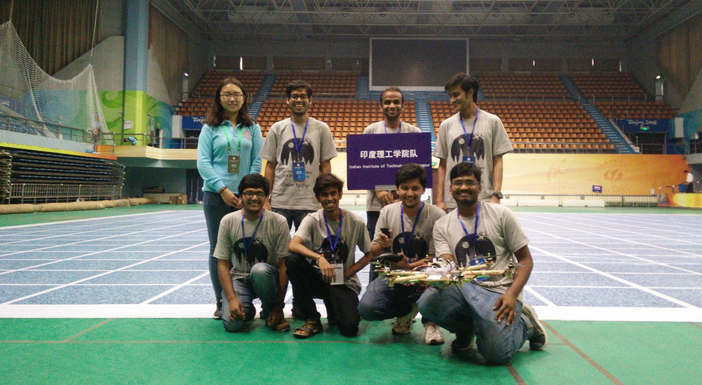
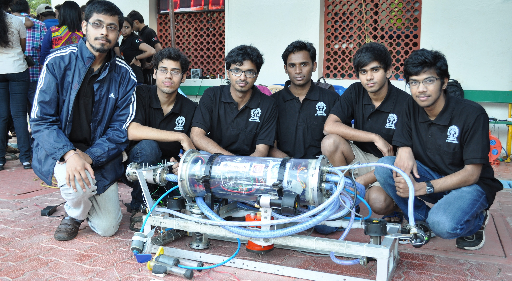
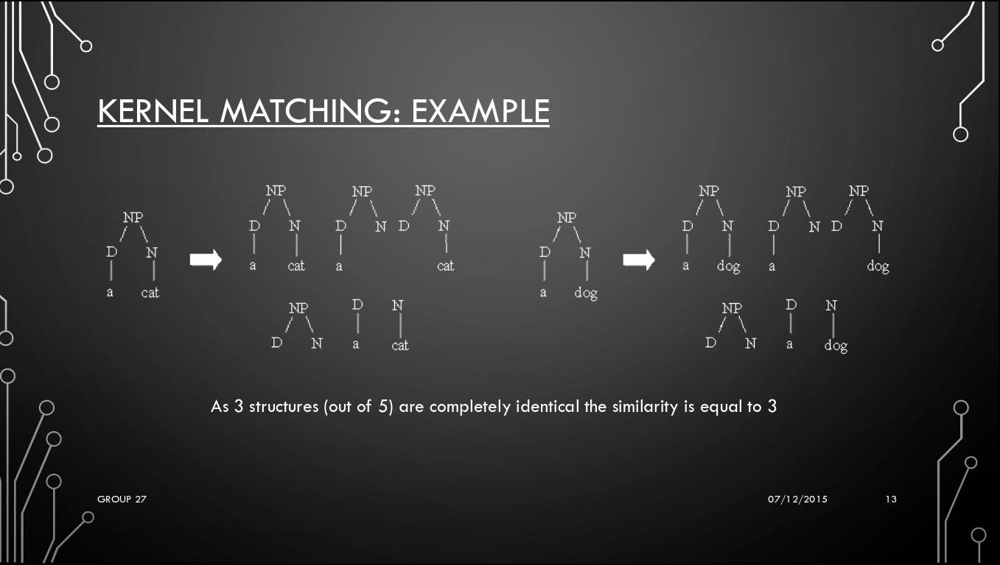

- ## [Persistent-Monitoring using Multi-Robot (UAV-UGV) Coordination](https://github.com/VishnuDuttSharma/CMSC818B_MiniProject_2/tree/main/python#persistent-monitoring-using-multi-robot-uav-ugv-coordination)
    *Course project for* ***Decision-Making for Robots (CMSC818B)*** *course at UMD, College Park (Fall 2020)*
    
     Persistent Monitoring in robotics is the problem of monitoring an area in repeated manner. This is useful for applications like monitoring forest fires, where we need to visit the repeatedly to look for signs of fire. This can be done using a team of Unmanned Ground Robots (UGVs). They can avoid overlaps if they know each other's locations. In a case where the communication range is limited, a UAV can be used to communicate such information by patrolling the area independently and sharing the information (or belief) about locations with UGVs.
     
     In this project we propose heuristic-based and RL-based strategy to move the UAV to increase the certainty about the location of the UGVs.
     
    

- ## [Empirical Study of Second-Order Optimizers for Deep Learning Applications](https://github.com/VishnuDuttSharma/cs5486_nas_s20/blob/master/project/Project_Report_Final.pdf)
    *Course project for* ***Numerical Analysis and Software*** *course at Virginia Tech (Spring 2020)*
    
    First-order optimizers (e.g. SGD, AdaGrad, Adam, etc.) is the most popular class of deep learning optimizers. Even though second-order optimizers, which employ second-order derivative of parameter, are more time-efficient, they find limited use in deep learning application due to the memory and computational overhead.
   
   This project compares the runtime of some variants of the second-order optimizers for classification and regression tasks and makes suggestions on when to use a particular optimizer.
   
    

- ## [SegNet: Reproduciblity and Qualitative Analysis](https://sites.google.com/vt.edu/amlf19project-pc-vds/home)
    *Course project for* ***Advanced Machine Learning*** *course at Virginia Tech (Fall 2019)*
    
    As the deep learning applications and research have grown at a breakneck speed in the past few years,  reproducibility has emerged as a major challenge. 
This project explores the reproducibility of SegNet model and qualitative analysis of driving data different locations in the worlds. We also see how the image properties affect the accuracy of the model.
   
    <iframe src="https://drive.google.com/file/d/1Um9PCVHrE8uHJGtKrvDRJNapo8aDIkou/preview" width="640" height="480"></iframe>

- ## [DeepVO](https://arxiv.org/abs/1611.06069)
    *Monocular Visual Odometry using deep learning*
    
    Deep Learning has shown tremendous efficacy in solving the computer vision problems with high accuracy. In this work, we explore the problem of monocular visual odometry i.e. tracking the distance traveled using a single camera for robotic applications, using a AlexNet inspired architecture.

- ## [Unmanned Aerial Robot](http://arl-kgp.github.io/)
    *Member of the controls team of Aerial Robotics Kharagpur (ARK) research group at IIT Kharagpur*
    
    As the head of the controls team of the Aerial Robotics Kharagpur (ARK) research group at IIT Kharagpur, I contributed to the development of an Autonomous Aerial Vehicle and participated at the International Aerial Robotic Competition (IARC) 2016, where the team won the Best Team Cooperation Award.

    

- ## [Autonomous Underwater Vehicle](https://auviitkgp.github.io/)
    *Member of the electronics team of Team AUV reseach group at IIT Kharagpur*
    
    Team AUV IIT Kharagpur works on the development of an Autonomous  Underwater Vehicle, capable of performing underwater navigation, object detection and manipulation. I contributed as a member and later as the head of the electronics team. I also participated at the Indian national student AUV competition 2014 with the team.

    

- ## [SIRIUS](https://github.com/RP-Hall/sirius)
    *Semi-autonomous shopping cart developed for annual inter-hall hardware exhibition competition 2015*
    
    Sporting a hybrid wheel-leg design, this all-terrain robot was RP Hall's entry to the 2014-15 Inter-Hall Hardware Exhibition Competition at IIT Kharagpur. Apart from the omni-directional motion using wheels, we also implemented gaits inspired by motion of dog and spider. The name itself is a nod to Sirius in Harry Potter books. 
   
   This robot was also IIT Kharagpur's entry to the 4th Inter-IIT Tech Competition (2016), where it won the silver medal.
   
   

- ## [Roach](https://github.com/RP-Hall/roach)
    *Semi-autonomous shopping cart developed for the annual inter-hall hardware exhibition competition 2014*
    
    Exploring an area with rugged terrain is difficult as a wheel may get stuck or fail to climb some surfaces. This robot, which was RP Hall's entry to the Inter-Hall Hardware Exhibition Competition (2013-14) at IIT Kharagpur, uses semi-circular wheel design to traverse all kinds of terrains.

    

- ## [SmartKart](https://github.com/RP-Hall/smartkart)
    *Semi-autonomous shopping cart developed for the annual inter-hall hardware exhibition competition 2013*
    
    An entry to the Annual Inter-Hall Hardware Exhibition Competition (2012-13) at IIT Kharagpur, this semi-autonomous shopping cart uses RFID tags and IR sensors to navigate the shopping arena, avoiding collisions, on the shortest path that includes all the items input by the user. This smart cart developed by the RP Hall of IIT Kharagpur won the silver medal at the competition.

    

- ## [Plagiarism Detection in C++ source codes using NLP Tree Kernels](http://cse.iitkgp.ac.in/~pawang/courses/SNLP15/Projects/Group_27%20Plagiarism%20Detection)
    *Course project for* ***Speach and Natural Language Processing*** *course at IIT Kharagpur (Autumn 2015)*
    
    In this project we use kernel-matching methods over Abstract Syntax Tress (ASTs) captured during the compilation of C++ codes to detect plagiarism. As this method uses abstract structures, it can detect plagiarism even if the name of the variables are changed. 
   
    

